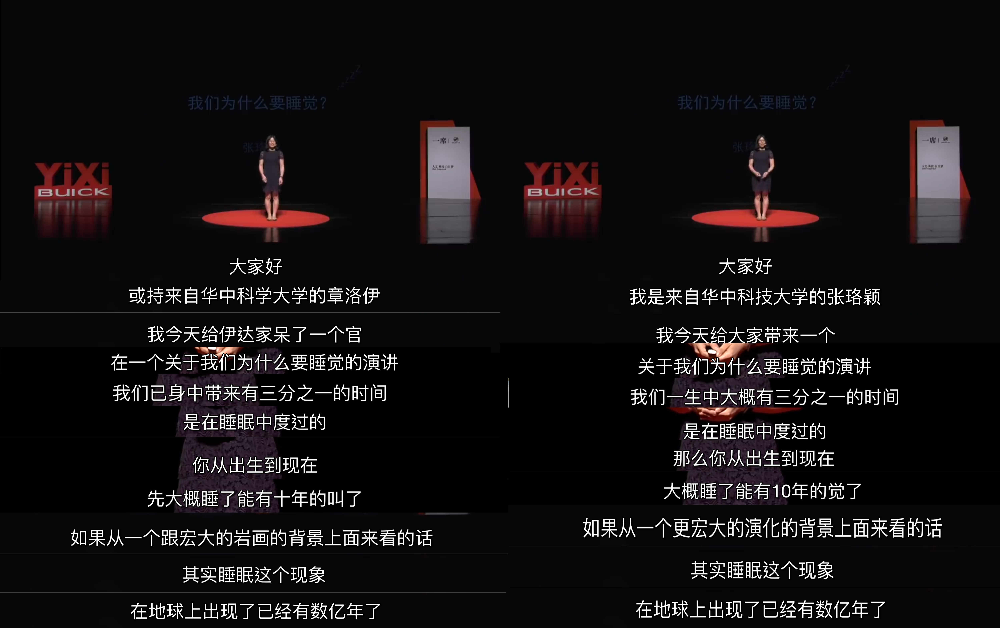

# 中文语音识别

by

```
   _____ _                    __  __ _                  _                   
  / ____| |                  |  \/  (_)                (_)                  
 | |    | |__   ___ _ __     | \  / |_ _ __   __ ___  ___  __ _ _ __   __ _ 
 | |    | '_ \ / _ \ '_ \    | |\/| | | '_ \ / _` \ \/ / |/ _` | '_ \ / _` |
 | |____| | | |  __/ | | |_  | |  | | | | | | (_| |>  <| | (_| | | | | (_| |
  \_____|_| |_|\___|_| |_( ) |_|  |_|_|_| |_|\__, /_/\_\_|\__,_|_| |_|\__, |
                         |/                   __/ |                    __/ |
                                             |___/                    |___/ 

chenmingxiang110@gmail.com
```

## 更新 2020.06.23

一些朋友提到，将识别得到的拼音转换成文字时，国内使用谷歌拼音输入法不太方便。我这里根据 wyf19941128 的建议，新写了通过谷歌翻译将拼音转成汉字的方案（国内访问谷歌翻译无需科学上网），所需代码附在 ./alternative 文件夹下。以下是一个实现转换的例子：

```
from Pinyin2SimplifiedChinese import *

t = translator()
print(t.translate("jin tian tian qi zhen bu cuo")) # return "今天天气真不错"
```

## 模型简介

模型输入是一段不长于10秒钟的语音，模型的输出是该语音所对应的拼音标签。本项目使用python 3.6为主要编程语言。

模型参考了Baidu Deep Speech 2：http://proceedings.mlr.press/v48/amodei16.pdf

使用了CNN+GRU+CTC_loss的结构

## 训练数据

所用的训练数据包含两个部分：

1. aishell-1语音数据集

AISHELL-ASR0009-OS1录音时长178小时，约14万条语音数据，下载地址：http://www.aishelltech.com/kysjcp

2. YouTube视频及对应字幕文件

从YouTube上获取MP4视频文件后转化成wav音频，同时使用对应的srt字幕文件作为target。总计时长大约120小时，有约20万条语音数据。数据量过大，且有版权归属问题，所以暂时不提供公开下载渠道。

## 使用方法

### 1. 训练模型

根据实际需求和硬件情况，可以选择需要的模型进行训练和调试。各个模型区别如下。如果实在含GPU的机器上训练模型，直接运行 train901.py，train902.py，或者train903.py 即可。如果是在CPU上训练，则运行 train901_cpu.py，train902_cpu.py，或者train903_cpu.py。

|模型名称 |CNN层数 |GRU层数 |GRU维度 |训练时间 |
|--- |--- |--- |--- |--- |
|901|2|3|256 |约30小时|
|902|2|5|256 |约55小时|
|903|2|5|1024|约130小时|

这里的训练时间仅仅是一个大概的统计，训练使用一块Tesla V100完成。

model 903 下载地址:
https://pan.baidu.com/s/1XB030KsXKv1tbVKMQ5s5BA 
密码:vlgr

下载后放在model文件夹下。

### 2. 识别音频

1. 初始化模型并加载必要的工具

```
import os
import time
import warnings
warnings.filterwarnings("ignore", message="numpy.dtype size changed")
warnings.filterwarnings("ignore", message="numpy.ufunc size changed")
with warnings.catch_warnings():
    warnings.simplefilter("ignore")
    import tensorflow as tf
import numpy as np
from urllib.request import urlopen

from lib.tools_batch import *
from lib.tools_math import *
from lib.tools_sparse import *
from lib.tools_audio import *
from lib.contrib.audio_featurizer import AudioFeaturizer
from lib.contrib.audio import AudioSegment

# 根据你所使用的模型修改这两行
from model903 import *
model_name = "v903"

pyParser = pinyinParser("lib/pinyinDictNoTone.pickle")
af = AudioFeaturizer()
model = model(409)
```

2. 初始化session并reload已经训练好的模型

```
sess = tf.Session()
saver = tf.train.Saver()
saver.restore(sess, "models/"+model_name+"/"+model_name+"_0.ckpt")
```

3. 读取音频并转化格式

```
rate, data = read_wav("data/test.wav")
data = mergeChannels(data)
data = zero_padding_1d(data, 160240)
a_seg = AudioSegment(data, rate)
xs = np.transpose(np.array([af.featurize(a_seg)]), [0,2,1])
```

4. 预测并转化成拼音

```
pred = model.predict(sess, xs)[0]
pred_dense = sparseTuples2dense(pred)
detected_line = []
for stuff in pred_dense[0]:
    if stuff!=-1:
        detected_line.append(stuff)
pinyin = pyParser.decodeIndices(detected_line, useUnderline = False)
```

5. 转化成汉字

```
response = urlopen("https://www.google.com/inputtools/request?ime=pinyin&ie=utf-8&oe=utf-8&app=translate&num=10&text="+pinyin)
html = response.read()
result = (html.decode('utf8')).split(",")[2][2:-1]
print(result)
```

这里转化成汉字这一步使用了谷歌拼音输入法。如果有需要也可以使用自定义的词表/Markov Chain/seq2seq模型。如果使用词表来定制输入法，可以参考我的另外一个project：https://github.com/chenmingxiang110/Android-pinyin-converter

## 效果和demo

ASR 应用场景十分多样。这里我做了一个自动添加字幕的demo，代码详见subtitle_demo.ipynb。一下为字幕添加效果。

1. 视频一，视频地址：https://www.youtube.com/watch?v=t5cPgIGNosc

左侧为自动添加的字幕，右侧为YouTuber人工手动添加的字幕



2. 视频二，视频地址：https://www.youtube.com/watch?v=HLJJlQkY6ro

左侧为自动添加的字幕，右侧为YouTuber人工手动添加的字幕


完整的字幕原文件和预测结果可以再data文件夹中找到。

```                                          
  _____ _              _    __   __          ___         __      __    _      _    _           
 |_   _| |_  __ _ _ _ | |__ \ \ / /__ _  _  | __|__ _ _  \ \    / /_ _| |_ __| |_ (_)_ _  __ _ 
   | | | ' \/ _` | ' \| / /  \ V / _ \ || | | _/ _ \ '_|  \ \/\/ / _` |  _/ _| ' \| | ' \/ _` |
   |_| |_||_\__,_|_||_|_\_\   |_|\___/\_,_| |_|\___/_|     \_/\_/\__,_|\__\__|_||_|_|_||_\__, |
                                                                                         |___/ 
                                              _..  
                                          .qd$$$$bp.
                                        .q$$$$$$$$$$m.
                                       .$$$$$$$$$$$$$$
                                     .q$$$$$$$$$$$$$$$$
                                    .$$$$$$$$$$$$P\$$$$;
                                  .q$$$$$$$$$P^"_.`;$$$$
                                 q$$$$$$$P;\   ,  /$$$$P
                               .$$$P^::Y$/`  _  .:.$$$/
                              .P.:..    \ `._.-:.. \$P
                              $':.  __.. :   :..    :'
                             /:_..::.   `. .:.    .'|
                           _::..          T:..   /  :
                        .::..             J:..  :  :
                     .::..          7:..   F:.. :  ;
                 _.::..             |:..   J:.. `./
            _..:::..               /J:..    F:.  : 
          .::::..                .T  \:..   J:.  /
         /:::...               .' `.  \:..   F_o'
        .:::...              .'     \  \:..  J ;
        ::::...           .-'`.    _.`._\:..  \'
        ':::...         .'  `._7.-'_.-  `\:.   \
         \:::...   _..-'__.._/_.--' ,:.   b:.   \._ 
          `::::..-"_.'-"_..--"      :..   /):.   `.\   
            `-:/"-7.--""            _::.-'P::..    \} 
 _....------""""""            _..--".-'   \::..     `. 
(::..              _...----"""  _.-'       `---:..    `-.
 \::..      _.-""""   `""""---""                `::...___)
  `\:._.-"""
```
